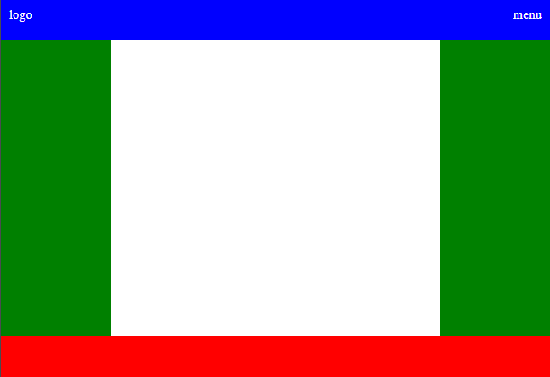

# Assignment - Create a basic layout with HTML and CSS

## Description

**Main story:**

We are creating a portfolio for a client. To get started we need a basic layout.
The client has requested a classic setup with a top menu bar, a footer bar and a center section for content. The center section should be divided in three columns.

The middle column will be used to display main content like projects. The left column should contain a picture and maybe some contact info, the right column should contain a small table filled with the clients skills.

**This assignment is about the layout only**

#

## Acceptance criteria

Create a basic three column layout

- There should be a header/navigation bar
	- height 50px
	- background color: blue
	- padding 10px
	- There should be a logo (placeHolder) in the left of the header
	- There should be a menu button on the right side of the header
- there should be a footer bar
	- height: 50px
	- background color: red
- The centre should be divided in three columns
	- Left column width: 20%
	- Left column background color: green
	- Right column width: 20%
	- Right column background color: green
	- Centre column background color: white
	- Centre column width: 60%
#

### Resource:
[W3Schools - CssFlexBox](https://www.w3schools.com/css/css3_flexbox.asp)

